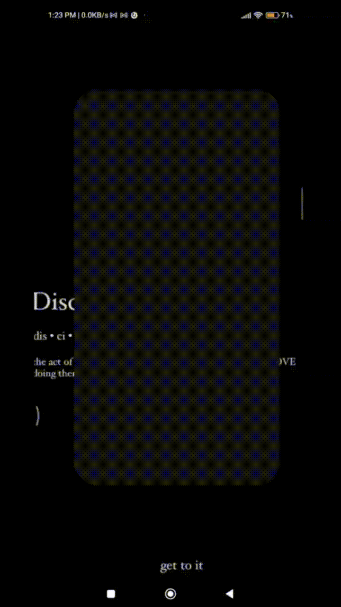

# 🎲 Dice Roller App  

A simple and elegant **Dice Roller** Android app built using **XML** for UI and **Kotlin** for logic.  Tap the button and let the dice roll for a random outcome — perfect for games, decision-making, or just for fun!  

## ✨ Features  
- 🎯 **Minimal & Clean UI** – Dark theme for a modern touch.  
- 🎲 **Random Dice Roll** – Generates a number between 1–6.  
- ⚡ **Lightweight** – Smooth performance with fast response.  
- 📐 **XML-based Design** – Fully designed using Android XML layouts.  
- 🖼 **Dynamic Dice Images** – Dice face updates instantly based on roll result.  

## 🛠 Tech Stack  
- **Language:** Kotlin  
- **UI Design:** XML  
- **Platform:** Android Studio  
- **Random Generator:** **kotlin.random.Random**  
